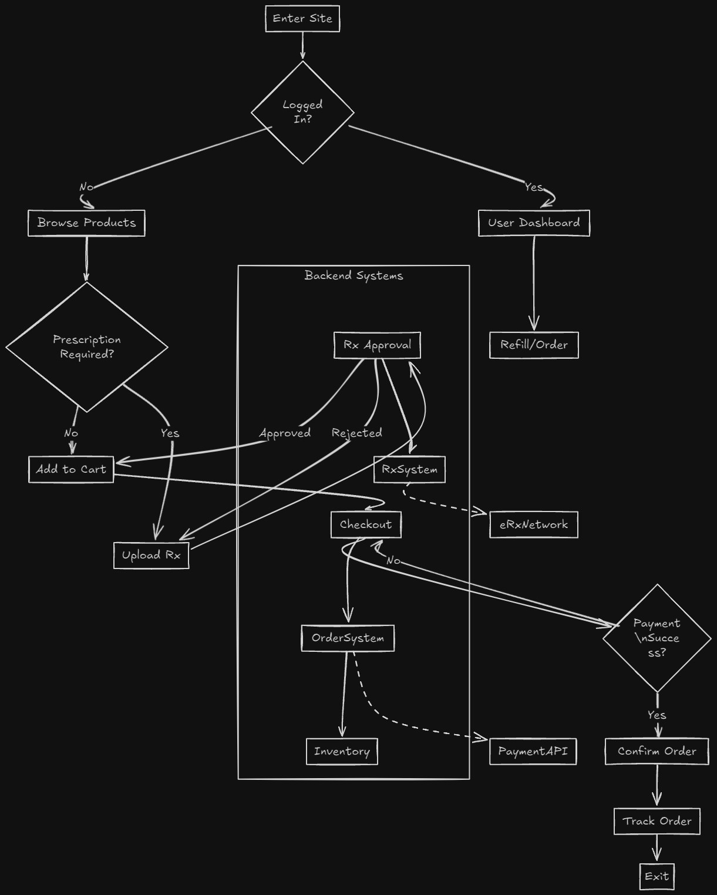

# Pharmacy Management System

A simple online system for local pharmacies to manage medicines

## Task 1

* Purpose or intro for pharmacy app
* System Design
* Overview description with features and business case
* Tech Stack

### Introduction

Pharmacy management System is an web app for management of medicines and display inventory status exists or sold out (need to update). It also manages orders and pharmacists selling and approve or reject prescriptions.

### #1 User Flow Diagram

### #2 Core Modules/Functions

* [ ] User Management
* [ ] Authentication
* [ ] Inventory Management
* [ ] Prescription
* [ ] Orders Management

#### Tech Stack

* Backend: Nodejs + Express
* Database: MySQL
* FrontEnd: React or Next.js
* Auth: JWT + Role-based Access

## Task 2

1. Each main task should be described with points
2. steps for implement these tasks

### User Management

* [ ] Users' Roles and Permissions (Admins, Pharmacists, Patients, Doctors)  
* [ ] Role hierarchy with permissions  

#### Steps

Step 1: Design a ER Model/Diagram

- users(id, name, email, password, role)
- medicines(id, name, category, price, stock, expiry_date)
- orders(id, user_id, status, total_price, created_at)
- order_items(id, order_id, medicine_id, quantity, price)
- prescriptions(id, user_id, file_path, status, uploaded_at)

Step 2: Create initial relational DB Tables  
Step 3: Create Backend folders and files structure  
Step 4: Create package.json file using "npm init --y"  
Step 5: fill tables with metadata

### Authentication

* [ ] JWT (LogIn/SignUp)

Step 1: Create registration & login forms (REACT)
Step 2: Create `/register` and `/login` API routes (Nodejs)
Step 3: Hash passwords (e.g. bcrypt use JWT for auth)
Step 4: Store users in MySQL (users table)
Step 5: Add role management (admin, pharmacist, patient)

### Medicine Inventory Module

* [ ] CRUD Operations

Step 1: Backend API for CRUD on Medicines
Step 2: Admin UI add/update/delete/create
Step 3: Patient UI to browse medicines

* Automatically subtracts sold medicines

* Adds new stock when deliveries arrive

* Shows warnings when stock is low

### Prescription Upload Module

* [ ] patient uploads prescription

Step 1: Allow uploading prescription (pdf/image)
Step 2: Admin approval workflow

* [ ] Pharmacist/Admin can approve or reject

### Cart & Order Module

* [ ] Add to Cart
* [ ] Checkout

## #3 Future Features

* [ ] Admin Dashboard
* [ ] Search & Filters
* [ ] Payment Integration
* [ ] Approve & Manage Prescription
* [ ] Email Notification
* [ ] Invoice Generator
* [ ] Multi-Store Support
* [ ] Doctor Module
* [ ] Chat Support
