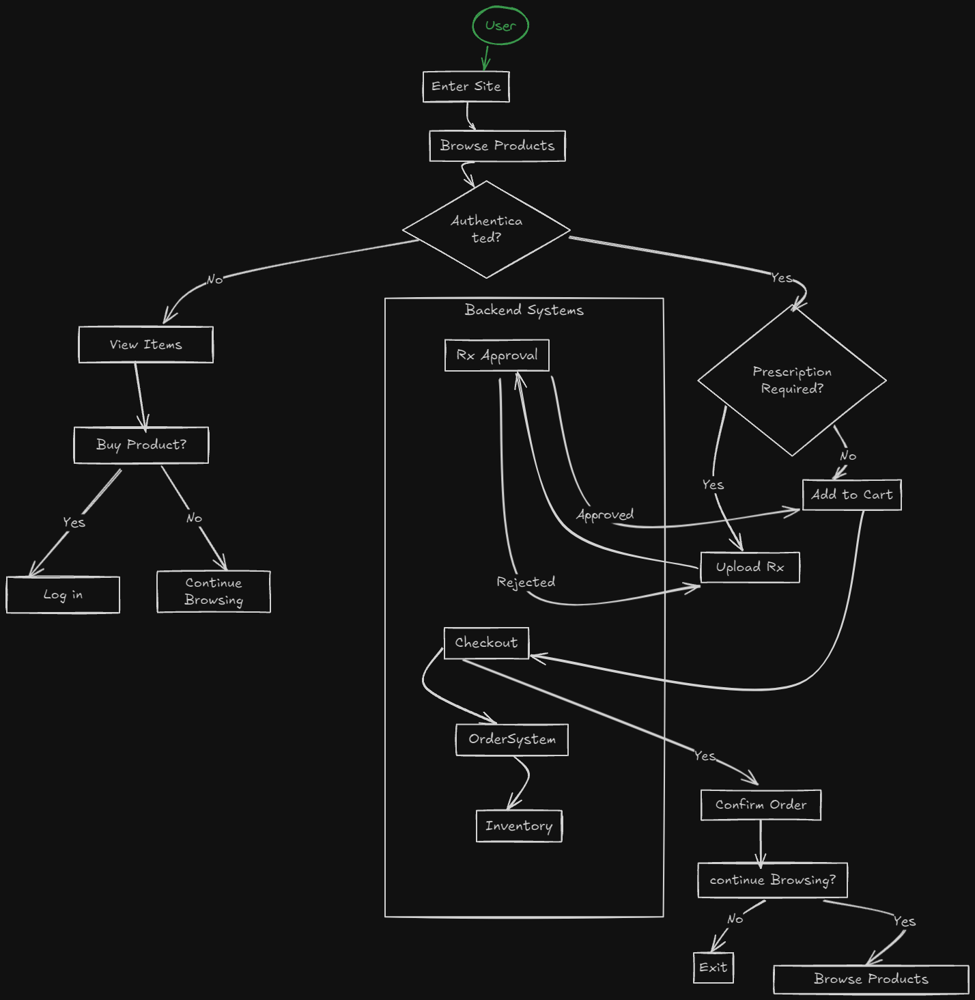
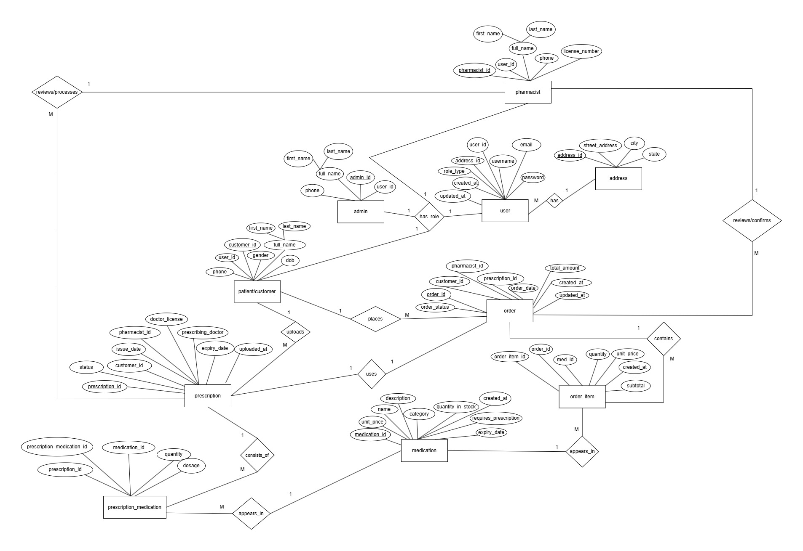

# Pharmacy Management System (EcoPharmacy)

A simple online system for local pharmacies to manage users-role system, medicines, prescriptions, inventory, and orders efficiently.

---

## Introduction

Pharmacy Management System is a full-stack web application that enables pharmacies to manage:

- Inventory of medicines
- User roles and authentication
- Prescription uploads and approvals
- Order placement and tracking

It supports both administrators and pharmacists in managing pharmacy workflows and assists patients in ordering medicines with or without prescriptions.

---

## Problem Statement

Pharmacy management systems often struggle with inefficient inventory tracking and prescription processing, leading to medication errors and operational delays.

- Manual inventory tracking leads to 15-20% medication waste annually
- 40% of pharmacies report prescription processing delays >24 hours

---

## Tech Stack

| Layer      | Technology               |
|------------|--------------------------|
| Backend    | Node.js, Express         |
| Database   | MySQL                    |
| Frontend   | NOT SPECIFIED            |
| Auth       | JWT + Role-Based Access  |

---

## System Overview

### Features

- User Registration and Role-Based Access (Admin, Pharmacist, Patient/Customer)
- Medicine Inventory Management
- Upload & Approve Prescriptions
- Order Medicines with Cart System
- Track Order History

### Core Modules

- [ ] User Management
- [ ] Authentication
- [ ] Inventory Management
- [ ] Prescription Handling
- [ ] Order Management

---

## User Flow Diagram



---

## Task Breakdown

### Task 1: System Design & Setup

- [ ] Purpose, Design, and Feature Overview
- [ ] Create ER Diagram and Plan DB Schema
- [ ] Setup project structure for frontend & backend
- [ ] Initialize `package.json` and install dependencies

---

### Task 2: Feature Development

---

### Authentication

- [ ] JWT-based login & registration
- [ ] Role-based access control

**Steps:**

1. Create registration & login forms (React)
2. Create `/register` and `/login` API routes (Node.js)
3. Hash passwords using bcrypt and issue JWT tokens
4. Store user info in MySQL `users` table
5. Enforce role-based route access

---

### User Management

- [ ] Handle different roles: Admin, Pharmacist, Patient, Doctor
- [ ] Define role hierarchy and permissions

## Entity Relationship Diagram (ERD)



---

## Setup Steps

1. Design Entity Relationship (ER) Diagram
2. Create MySQL tables from the schema
3. Create backend folder structure (Node.js + Express)
4. Initialize project using `npm init -y`
5. Seed database with sample data

---

## Medicine Inventory Module

### Features

- Admin: Add, Edit, Delete, and View Medicines (CRUD)
- Patient: Browse available medicines
- Automatically subtract stock when an order is placed
- Restock when new deliveries arrive
- Alert on low stock levels

### Implementation Steps

1. Backend APIs for CRUD operations (Node.js + Express)
2. Admin UI for inventory control (React/Next.js)
3. Patient UI to browse medicines (React/Next.js)

---

## Prescription Upload Module

### Features

- Patients can upload prescriptions (PDF or Image)
- Pharmacists/Admins can approve or reject them

### Implementation Steps

1. Setup file upload using **Multer** (Node.js)
2. Store file path and metadata in the `prescriptions` table
3. Admin/Pharmacist UI to view and approve/reject files

---

## Cart & Order Module

### Features

- Patients can add medicines to cart
- Checkout process to place orders
- View order history and track statuses

### Implementation Steps

1. Implement cart system (Frontend state management + backend persistence)
2. Checkout API to insert into `orders` and `order_items` tables

---

## Project Root Structure

```plaintext
pharmacy-app/
│
├── backend/                # Express + Node + MySQL
├── frontend/               # React (or Next.js if SSR)
├── database/               # SQL schema, ERD, migrations
├── docs/                   # Docs, flowcharts, UI mockups
├── .env                    # Global shared settings (if any)
├── README.md
└── docker-compose.yml      # (optional: for dev containers)
```

## backend Structure

```plaintext
backend/
│
├── src/
│   ├── config/             # MySQL config, .env loader
│   ├── controllers/        # Business logic (e.g. userController.js)
│   ├── middlewares/        # auth, error handling, logging
│   ├── models/             # SQL logic or ORM (e.g. Sequelize/Knex)
│   ├── routes/             # Route files grouped by domain
│   ├── services/           # Logic used by controllers (e.g. token, mail)
│   ├── utils/              # Common utilities (validators, helpers)
│   ├── uploads/            # Prescription file storage
│   └── app.js              # Express app setup
│
├── tests/                  # Backend unit/integration tests
├── server.js               # Entry point
├── .env
└── package.json
```

## frontend Structure

```plaintext
frontend/
│
├── public/                 # Static files
├── src/
│   ├── assets/             # Icons, images
│   ├── components/         # Reusable components (Button, Card, etc.)
│   ├── layouts/            # Page layouts (DashboardLayout, AuthLayout)
│   ├── pages/              # Route-level pages (Login, Inventory, Orders)
│   ├── services/           # API requests (Axios-based)
│   ├── contexts/           # React context (auth, cart, etc.)
│   ├── hooks/              # Custom hooks
│   ├── utils/              # Formatters, converters
│   └── App.jsx
│
├── tests/                  # Frontend tests (Jest + Testing Library)
├── .env
└── package.json
```

## database (MySQL)

```plaintext
database/
│
├── schemas/                # SQL schema definitions
│   └── pharmacy_schema.sql
│
├── migrations/             # Optional: migration scripts
├── seeders/                # Mock data for testing/dev
└── erd/                    # PNG/SVG/Draw.io of ER diagram
```

## docs Directory

```plaintext
docs/
│
├── system_design.md
├── feature_checklists/
├── screenshots/
└── api_docs.md
```

---

## Future Features (Extended)

- [ ] Admin Dashboard for full system analytics
- [ ] Advanced search & filtering on medicines
- [ ] Payment integration (Stripe/PayPal)
- [ ] Invoice generator on order confirmation
- [ ] Multi-store management for chain pharmacies
- [ ] Doctor module for digital prescription issuance
- [ ] Email notifications for orders and approvals
- [ ] Real-time chat support for patient queries
